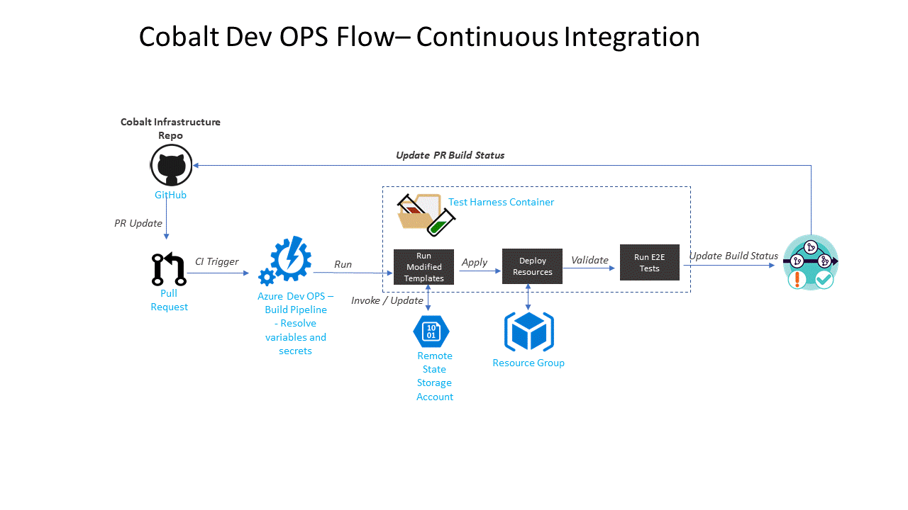

- [Cobalt](#cobalt)
  - [Getting Started with Cobalt](#getting-started-with-cobalt)
  - [Infrastructure Setup: How it works](#infrastructure-setup-how-it-works)
  - [How Cobalt differs from Bedrock](#how-cobalt-differs-from-bedrock)
  - [About the Repository](#about-the-repository)
    - [Infrastructure as Code](#infrastructure-as-code)
    - [Continuous Integration / Deployment + Testing](#continuous-integration--deployment--testing)
      - [Azure DevOps CI Flow](#azure-devops-ci-flow)
  - [Community](#community)
  - [Contributing](#contributing)

# Cobalt

[](https://dev.azure.com/csedallascrew/project-cobalt/_build/latest?definitionId=2&branchName=master)
[](https://goreportcard.com/report/github.com/microsoft/cobalt)

This project is an attempt to combine and share best practices when building production ready [cloud native](https://www.cncf.io/) managed service solutions. Cobalt's infrastructure turn-key starter [templates](/infra/templates/README.md) are based on real world engagements with enterprise customers.

This project puts a focus on infrastructure scalability, security, automated testing and deployment repeatability and most importantly, developer experience. Cobalt's intended audience is for developers. Feedback and suggestions are encouraged through issue requests. We welcome contributions across any one of the major cloud providers.

Cobalt is a joint collaboration with project [Bedrock](https://github.com/Microsoft/bedrock).

## Getting Started with Cobalt

The best steps for getting started depends on your high level goals. Select the correct set of instructions based on your overall use case for Cobalt.

- [Getting Started - Cobalt Developer](./GETTING_STARTED_DEV.md): Start here if you want to contribute to Cobalt templates or pipelines.
- [Getting Started - Advocated Pattern Owner](./GETTING_STARTED_ADD_PAT_OWNER.md): Start here if you want to maintain Cobalt templates within your organization so that application developer teams can use them.
- [Getting Started - Application Developer](./GETTING_STARTED_APP_DEV.md): Start here if you are an application developer at an organization that is already using Cobalt.

## Infrastructure Setup: How it works


## How Cobalt differs from Bedrock

Cobalt hosts reusable Terraform modules to scaffold managed container services like [ACI](https://docs.microsoft.com/en-us/azure/container-instances/) and [Application Services](https://docs.microsoft.com/en-us/azure/app-service/) as a couple of examples. Bedrock targets Kubernetes-based container orchestration workloads while following a [GitOps](https://medium.com/@timfpark/highly-effective-kubernetes-deployments-with-gitops-c7a0354f1446) devops flow. Cobalt templates reference Terraform modules like virtual networks, traffic manager, etc.

## About the Repository

### Infrastructure as Code

Cobalt infrastructure templates are written in Terraform and can be found in the templates [folder](infra/templates). Each subfolder represents a unique deployment schema and is packaged with a set of Terraform scripts, overview and setup instructions and automated unit & integration tests.

Each template makes use of Terraform [modules](https://www.terraform.io/docs/modules/index.html) across both Bedrock and [Cobalt](infra/modules). Cobalt's module registry is categorized by cloud provider then resource type. Each modules represents an abstraction for the set of related cloud infrastructure objects that the module will manage.

```bash
$ tree infra
├───modules
│   └───providers
│       ├───azure
│       │   ├───api-mgmt
│       │   ├───app-gateway
│       │   ├───provider
│       │   ├───service-plan
│       │   ├───tm-endpoint-ip
│       │   ├───tm-profile
│       │   └───vnet
│       └───common
└───templates
    ├───az-hello-world
    │   └───test
    │       └───integration
    └───backend-state-setup
```

### Continuous Integration / Deployment + Testing

Cobalt Continuous Integration pipeline definitions are available in the `./devops/provider` folder. As of today, Cobalt provides a git devops workflow [definition](devops/providers/azure-devops/templates/azure-pipelines.yml) for Azure DevOps. We welcome pipelines from other providers like Jenkins.

#### Azure DevOps CI Flow



This pipeline is configured to trigger new builds for each new PR.

1. Deployment credential secrets such as service principal and terraform remote state storage accounts are sourced in azure keyvault.
2. The pipeline downloads secrets from keyvault and used to resolve terraform template variables.
3. The test harness image will be re-built. This includes copying any changes to Terraform scripts and the associated Terraform tests.
4. The test harness container will be run. It will perform the following stages.
    * Run a lint check on all golang test files and terraform templates.
    * Executes all golang unit tests.
    * Generate and validate the terraform plan.
    * Apply the terraform template resource updates to the development integration deployment environment.
    * Run end-to-end integration tests.
    * Tear down deployed resources.
5. Update the build and PR status.
6. Begin code review once the PR status is green.


## Community

[Please join us on Slack](https://publicslack.com/slacks/https-bedrockco-slack-com/invites/new) for discussion and/or questions.

## Contributing

We do not claim to have all the answers and would greatly appreciate your ideas and pull requests.

This project welcomes contributions and suggestions. Most contributions require you to agree to a
Contributor License Agreement (CLA) declaring that you have the right to, and actually do, grant us
the rights to use your contribution. For details, visit https://cla.microsoft.com.

When you submit a pull request, a CLA-bot will automatically determine whether you need to provide
a CLA and decorate the PR appropriately (e.g., label, comment). Simply follow the instructions
provided by the bot. You will only need to do this once across all repos using our CLA.

This project has adopted the [Microsoft Open Source Code of Conduct](https://opensource.microsoft.com/codeofconduct/).
For more information see the [Code of Conduct FAQ](https://opensource.microsoft.com/codeofconduct/faq/) or
contact [opencode@microsoft.com](mailto:opencode@microsoft.com) with any additional questions or comments.

For project level questions, please contact [Erik Schlegel](mailto:erisch@microsoft.com) or [James Nance](mailto:james.nance@microsoft.com).
