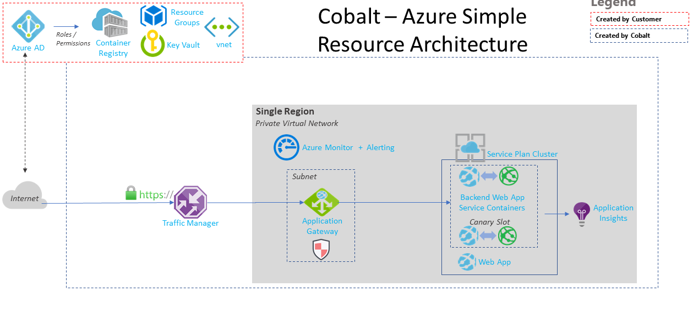

> **Note: This Markdown file has been created to show what the quickstart page for a given template will look like. In production, this content will not be saved in a Markdown file. Instead, the static site generator will iterate through information provided in the template's readme (*e.g.,* azure-simple.md) and its associated GitHub files (*e.g.,* `/templates/azure-simple/main.tf`) to directly render an HTML page.**

# Azure Simple: Quickstart

<!---
This content was generated automatically using the target filename.
--->

This quickstart guide will help you get up and running with the `azure-simple` template.

<!---
This content was generated automatically using the target filename.
--->



## Template configuration

<!---
This content was generated automatically from `variables.tf` using `terraform-docs` (https://github.com/segmentio/terraform-docs).
--->

| Name | Description | Type | Default | Required |
|------|-------------|:----:|:-----:|:-----:|
| address\_space | The address space that is used by the virtual network. | string | `"10.0.0.0/16"` | no |
| app\_service\_name | The name key value pair where the key is the name assigned to the app service and value is the source container | map | n/a | yes |
| appgateway\_backend\_http\_protocol | The backend protocol for the Appication Gateway to be created | string | `"Https"` | no |
| appgateway\_frontend\_port\_name | Name that will be given to the front-end port | string | n/a | yes |
| appgateway\_http\_listener\_protocol | The Http Listener protocol for the Appication Gateway to be created | string | `"Https"` | no |
| docker\_registry\_server\_password | The password used to authenticate with the container regitry | string | `""` | no |
| docker\_registry\_server\_url | The url of the container registry that will be utilized to pull container into the Web Apps for containers | string | `"index.docker.io"` | no |
| docker\_registry\_server\_username | The username used to authenticate with the container registry | string | `""` | no |
| name | The name of the deployment.  This will be used across the resource created in this solution | string | n/a | yes |
| resource\_group\_location | The deployment location of resource group container all the resources | string | n/a | yes |
| subnet\_names | A list of public subnets inside the vNet. | list | `<list>` | no |
| subnet\_prefixes | The address prefix to use for the subnet. | list | `<list>` | no |
| subnet\_service\_endpoints | The list of service endpoints that will be given to each subnet | list | `<list>` | no ||


## Module configuration

<!---
This content was generated automatically from `main.tf`.
--->

Each module in the `azure-simple` template contains its own configuration options. Click the links below to learn more.
 - [`service-plan`](https://microsoft.github.io/orion/service-plan#Configuration)
 - [`app-service`](https://microsoft.github.io/orion/app-service#Configuration)
 - [`app-insights`](https://microsoft.github.io/orion/app-insights#Configuration)


## Deployment steps

Create a new Terraform template directory and add a `main.tf` file. Here's a sample that uses the `azure-simple` template.

<!---
This content was generated automatically from `terraform.tfvars`.
--->

```
module "azure-simple" {
  name                            = "cobalt-azure-simple"
  resource_group_location         = "eastus"
  source                          = "https://github.com/microsoft/cobalt/tree/master/infra/templates/azure-simple"
  app_service_name                = {cobalt-backend-api = "DOCKER|msftcse/cobalt-azure-simple:0.1"}
}
```

Call the `terraform init`, `terraform plan`, and `terraform apply` commands within the template directory to initialize the Terraform deployment then write and apply the plan.


```
export TF_VAR_remote_state_account=<tf-remote-state-storage-account-name>
export TF_VAR_remote_state_container=<tf-remote-state-storage-container-name>
terraform init -backend-config "storage_account_name=${TF_VAR_remote_state_account}" -backend-config "container_name=${TF_VAR_remote_state_container}"
terraform plan
terraform apply
```

The following resources will be created:

 - Linux App Service Plan
 - App Service Container + staging slot
 - Application Insights Instance
 - vnet + subnet for app gateway
 - Application Gateway with an enabled Firewall
 - Traffic Manager Profile
 - Traffic Manager Endpoint
 - Azure Monitoring Rules
 - Public IP(for TM + AG)


## Outputs

<!---
This content was generated automatically from `ouputs.tf` using `terraform-docs` (https://github.com/segmentio/terraform-docs).
--->

| Name | Description |
|------|-------------|
| app\_service\_default\_hostname |  |
| app\_service\_name |  
