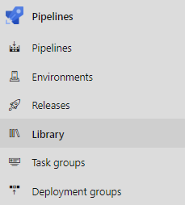
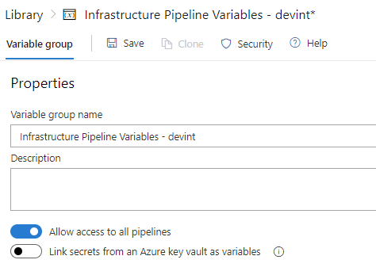
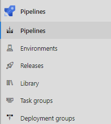
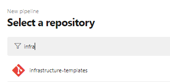
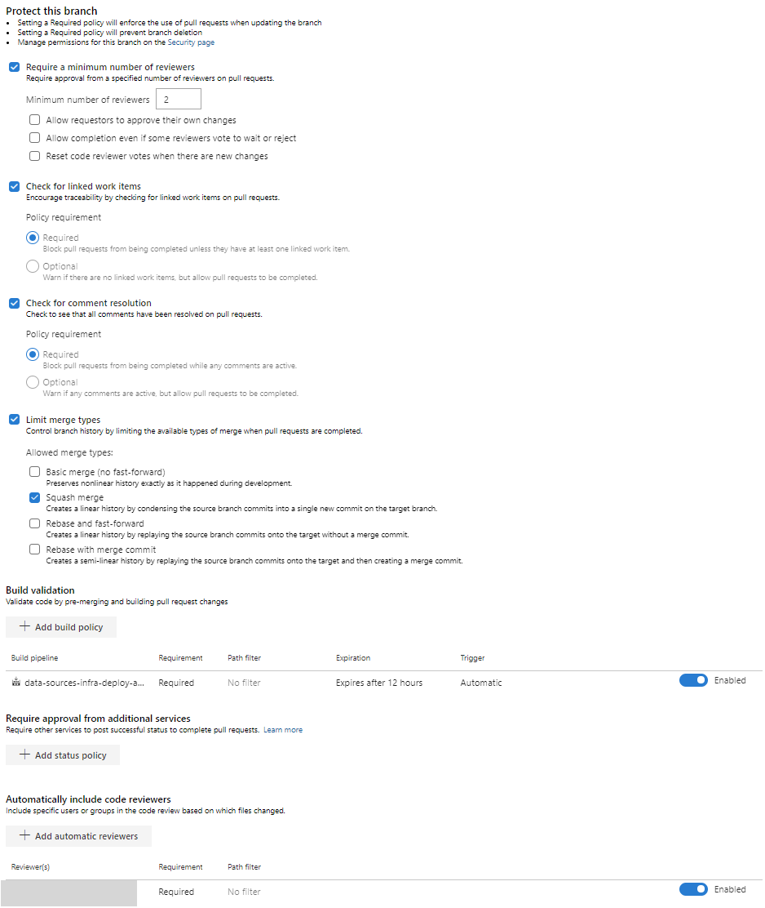

# Infrastructure deployment into Azure via Azure DevOps

This document describes how to deploy a *Cobalt Infrastructure Template* using Azure DevOps. The deployment of these resources are standardized using a set of Azure DevOps `yaml` templates. These templates automate and standardize the execution of Terraform templates across various deployment environments.

Please visit the following page for an overview of the Infrastructure Template repo's Azure Devops CI Flow: [Getting Started Cobalt Developer](../../../docs/GETTING_STARTED_COBALT_DEV.md).

## Prerequisites

- An [Azure subscription](https://portal.azure.com/) will be needed as a target to deploy resources into. You may want one of these for each deployment stage.
- A basic understanding of using [Terraform](https://learn.hashicorp.com/terraform?track=azure#azure) for Azure deployments.

## Step 1: Account Setup

- **[Azure Service Principal (Service Connection)](https://docs.microsoft.com/en-us/azure/active-directory/develop/howto-create-service-principal-portal)**

  This will be needed in order to provide the deployment templates the appropriate permissions to deploy infrastructure within an Azure subscription.
  - See Step 2 and 3 from [Getting Started - Advocated Pattern Owner](../../../docs/GETTING_STARTED_ADD_PAT_OWNER.md) ("_Provision Azure resources needed for Azure Devops pipeline_")/ ("Configure Azure Devops pipeline using Azure resource values") for more information.
  - Also see [Variable Group Overview](###Variable-Group-Overview) of this document for account setup naming recommendations.

- **[Azure Storage Account and Backend State Container](https://docs.microsoft.com/en-us/azure/storage/common/storage-account-overview)**

  These will be needed to hold the remote Terraform state of the infrastructured deployed from your Cobalt Terraform template deployments. Here are some instructions for creating the account and backend state container:

    * Login to the [Azure portal](https://portal.azure.com/)
      * Filter for Storage accounts and navigate to the storage account list
      * Click [+/Add] and enter values for the following fields:
          * Subscription: Your preferred enterprise subscription for Cobalt template deployments
          * Resource group: Create new (ex. `infrastructure-commons`)
          * Storage account name: (ex. `tstate6425`)
      * Click [Review+Create] then [Create]
      * Once deployment for storage account is completed, go to the resource and visit the Blobs sub-menu
      * Click [+Container] then create a container name (ex. `tstate`) with private access

## Step 2: Variable Groups

Execution of the infrastructure deployment pipeline relies on various Azure Devops variable groups. In this step, we provide two sections for understanding how to setup Variable Groups:

- [Variable Group Overview](###Variable-Group-Overview)
- [Configure Variable Groups](###Steps-for-configuring-variable-groups)

### Variable-Group-Overview

The following groups must be defined. Refer to these tables when following the steps to [Configure-Variable-Groups](###Steps-for-configuring-variable-groups):

- `Infrastructure Pipeline Variables` group

    | name | value | description | sensitive? | source |
    | ---  | ---   | ---         | ---        | ---    |
    | `AGENT_POOL` | ex: `Hosted Ubuntu 1604` | Agent on which to run release | no | ADO |
    | `BUILD_ARTIFACT_NAME` | ex: `infra-templates` | Name to identity the folder containing artifacts output by a build. | no | ADO |
    | `FORCE_RUN` | ex: `False` | Forces pipeline to execute a fully exercised build and release cycle by silencing template change detection. | no | ADO |
    | `SERVICE_CONNECTION_NAME` | ex: `cobalt-service-principal` | The default service connection used for deployments. This can be overridden for each stage, if needed | no | Azure Service Principal |

- `Infrastructure Pipeline Variables - {env_name}` group
    > `{env_name}` is `devint`, `qa`, `prod`, etc...

    | name | value | description | sensitive? | source |
    | ---  | ---   | ---         | ---        | ---    |
    | `ARM_SUBSCRIPTION_ID` | ex: `e8868aa3-318c-46a4-8b16-28d32e57db51` | The Azure subscription ID for which all resources will be deployed. | no | Azure account |
    | `REMOTE_STATE_ACCOUNT` | ex: `tf-remote-state-acct` | The name of the remote state account for the stage deployments | no | Azure account |
    | `REMOTE_STATE_CONTAINER` | ex: `tf-remote-state-container` | The name of the remote state container for the stage deployments | no | Azure account |

- `Infrastructure Pipeline Secrets - {env_name}` group
    > `{env_name}` is `devint`, `qa`, `prod`, etc...

    Enable 'Link secrets from an Azure key vault as variables'. This is where any secrets should be sourced from. By default, there are no secrets to store but nearly every deployment will require secrets. You can put them here! Visit [Link ecrets from an Azure key vault](https://docs.microsoft.com/en-us/azure/devops/pipelines/library/variable-groups?view=azure-devops&tabs=yaml#link-secrets-from-an-azure-key-vault) for more guidance.

### Steps-for-configuring-variable-groups

Variable groups can be created in the Azure Devops portal or optionally through the Azure Devops CLI. Here are the portal instructions:

> Need help? More instructions for creating Variable Groups can be found [here](https://docs.microsoft.com/en-us/cli/azure/ext/azure-devops/pipelines/variable-group/variable?view=azure-cli-latest).

1. Select Pipelines menu from within the side-navigation panel
1. Select Library

    

1. Select [+ Variable group] to add a new variable group
1. Create Variable groups based on your knowledge from the [Variable-Group-Overview](###Variable Group Overview)
1. Select Save

    

## Step 3: Pipeline Configuration

Execution of the pipeline depends on a collection of `yaml` files designed to spin-up infrastructure resources from one environment to the next.  In this step, we provide two sections for understanding how to configure the pipeline:

- [YAML File Overview](###YAML-File-Overview)
- [Steps for configuring the pipeline](###Steps-for-configuring-the-pipeline)

### YAML-File-Overview

Infrastructure will typically leverage the following common templates to configure their build and release stages:

- `<entry-point>.yml` (ex. azure-pipelines.yml)
- `devops/infrastructure/prepare-stage.yml`
- `devops/infrastructure/validate-job.yml`
- `devops/infrastructure/build-stage.yml`
- `devops/infrastructure/deploy-stages.yml`

#### entry_point

Here's an example of an entry point `yaml` file. Entry point `yaml` files forward configured values to other `yaml` files for execution. This file must be configured before executing the pipeline.

```yaml
# Omitting PR and Trigger blocks...

variables:
  - name: 'TF_VERSION'
    value: '0.12.20'
  - name: 'GO_VERSION'
    value: '1.12.14'
  - name: 'TF_ROOT_DIR'
    value: 'infra'
  - name: 'PIPELINE_ROOT_DIR'
    value: 'devops/providers/azure-devops/templates/infrastructure'
  - name: 'TEST_HARNESS_DIR'
    value: 'test-harness'
  - group: 'Infrastructure Pipeline Variables'

stages:
- template: prepare-stage.yml
  parameters:
    environments:
    - name: 'devint'
      enablePrIsolation: false
    - ${{ if eq(variables['Build.SourceBranchName'], 'master') }}:
      - name: 'qa'
        enablePrIsolation: false
      - name: 'prod'
        enablePrIsolation: false

    configurations:
    - jobName: az_hw
      terraformTemplatePath: infra/templates/az-hello-world
      terraformWorkspacePrefix: hw
      deploymentTimeoutInMinutes: 10  # Not supported as a Variable :-(
      environmentsToTeardownAfterRelease:
      - 'devint'
```

There are some key configurations that are worthwhile to understand:

  | key configurations | descriptions |
  | ---  | ---   |
  | `environments` stanza | This controls where the application will be deployed to. You will want the `- name:` attribute declared for each environment (`{env_name}`) defined by your infrastructure pipeline variable groups. In the example shown here, the environments deployed will also depend on whether or not the build has been triggered from the `master` branch. This enables Pull Request builds to deploy only to `devint`. Add a `- name:` attribute for all desired deployment environments. |
  | `configurations` stanza | This controls which Cobalt Terraform Templates this pipeline will deploy. In the example shown, we are configuring the pipeline to deploy the az-micro-svc-small-elastic-cloud template. You will want the `- jobName:` attribute declared for each Cobalt Terraform Template you plan to deploy. |
  | `enablePrIsolation:` attribute | When true, enables pipeline runs to achieve testing isolation by injecting the Azure Devops system pull request number into the appropriate Azure resource names deployed during pull requests. |
  | `terraformWorkspacePrefix:` attribute | A prefix that's applied to the remote backend state file which holds the state of a template's deployed infrastructure. This helps pipeline users isolate and/or manage unique Terraform workspace states. |
  | `terraformTemplatePath:` attribute | This provides the source code path to the current Cobalt Terraform Template in scope when looping through configurations. Build and release of templates happen synchronously. |
  | `deploymentTimeoutInMinutes:` attribute | Sets a window of time for which the deploy stage can run before it times out. The nature of infrastructure deployments demand this feature. |

#### [prepare-stage.yml](../../devops/infastructure/prepare-stage.yml)

The `prepare_stage.yml` uses the parameters passed to it from the entry point `yaml` file to coordinate the below 4 `yaml` files.

- #### [validate-job.yml](../../devops/infastructure/validate-job.yml)

  The `validate-job.yml` runs linting. It's the very first job that is ran. If linting passes, all source code files are then copied into the staging directory for jobs in later stages. This job does not consume parameters.

- #### [detect-cicd.yml](../../devops/infastructure/tasks/detect-cicd.yml)

  Per environment, the `detect-cicd.yml` is ran for every `- jobName:` listed in the `configurations` parameter. The purpose of this task is to emit a flag that determines rather or not the type of file committed to the branch justifies a fully exercised build and release cycle. Committing a markdown file is one example of the type of file that would trigger a pipeline run that skips the build and release stages defined in the `build-stage.yml` and `deploy-stage.yml`. Update this file to control the behavior of which file commits should not trigger a build and release cycle.

- #### [build-stage.yml](../../devops/infastructure/build-stage.yml)

  Per environment, the `build-stage.yml` is ran for every `- jobName:` listed in the `configurations` parameter. The purpose of this stage is to run the `Terraform plan` command in order to successfully build a Terraform plan for a specific template. Variable from the variable groups are consumed to make the below primarey features work. The final task in this file copies source code back into the staging directory.

    | primary features | build stage file | behavior |
    | ---  | ---   | ---  | 
    | Environment Based Builds | `prepare-stage.yml` | This file enables the build scripts to run builds for a list of Terraform templates per environment. The ability to execute multiple templates (as opposed to one) per environment is desirable. |
    | Workspace Computation w/ Pull Request Isolation | `tf-ws-compute.yml` | This is the first task of the build stage. It calculates and emits a Terraform workspace naming convention (ex. pullrequestnumber+prefix+environment) that will later be injected into the appropriate Azure resource names generated for a template's Terraform plan. This feature protects Azure infrastructure resources from naming and state collisions. |
    | Unit Tests | `tests-unit.yml` | This file navigates to the directory of the current Terraform template in scope in order to make test assertions against it's Terraform plan. Unit tests need variables like the `SERVICE_CONNECTION_NAME` in order to have permissions to run commands that rely on the Azure and Terraform cli. Unit tests are ultimately implemented by [Cobalt's testing harness](https://github.com/microsoft/cobalt/blob/d3a6610cde033b1ddf5dface7109abb54fd47fec/docs/4_TEMPLATE_TESTING.md#step-5-write-unit-tests). |
    | Remote Backend Terraform Workspace | `tf-ws-create.yml` | This file runs `terraform init` to initialize a backend state file within the Azure Storage account container. It also creates a Terraform workspace using the name emitted from the workspace computation to do the job. |
    | Terraform plan | `tf-plan.yml` | This file navigates to the directory of the current Terraform template in scope in order to execute `terraform plan`. A basic understanding of how to use Cobalt via the [Cobalt Quickstart Guide](https://github.com/microsoft/cobalt/blob/61e4200e0c0b60566bdc0f355c3a1819f3ae71a5/docs/2_QUICK_START_GUIDE.md) to deploy Terraform templates can help. |

- #### [deploy-stage.yml](../../devops/infastructure/deploy-stage.yml)

  Per environment, the `deploy-stage.yml` is ran for every `- jobName:` listed in the `configurations` parameter. This stage is meant to run the `Terraform apply` command that deploys a specific template's infrastructure into Azure. The final task in this file runs integration tests.

    | primary features | deploy stage file | behavior |
    | ---  | ---   | ---  |
    | Environment Based Deployments | `prepare-stage.yml` | This file enables the deploy scripts to run deployments for a list of Terraform templates per environment. The ability to execute multiple templates (as opposed to one) per environment is desirable. |
    | Workspace Computation w/ Pull Request Isolation  | `tf-ws-compute.yml` | Same as described above |
    | Remote Backend Terraform Workspace | `tf-ws-create.yml` | Same as described above |
    | Template Execution | `tf-apply.yml`  | Build artifacts are downloaded into this stages directory so that the `Terraform apply` command can be run. This command deploys infrastructure resources to Azure. A basic understanding of how to use Cobalt via the [Cobalt Quickstart Guide](https://github.com/microsoft/cobalt/blob/61e4200e0c0b60566bdc0f355c3a1819f3ae71a5/docs/2_QUICK_START_GUIDE.md) to deploy Terraform templates can help. |
    | Integ Tests | `tests-int.yml` | Once the `Terraform apply` is finished executing, this file runs integration tests against the endpoint of the current template's deployed Azure infrastructure. Integration tests are ultimately implemented by Unit tests are ultimately implemented by [Cobalt's testing harness](https://github.com/microsoft/cobalt/blob/d3a6610cde033b1ddf5dface7109abb54fd47fec/docs/4_TEMPLATE_TESTING.md#step-5-write-unit-tests). |


### Steps-for-configuring-the-pipeline

The infrastructure deployment pipeline is created and setup by pointing to the appropriate entry point `yaml` file used for the template. For example, the pipeline-env-managed-svc.yml can execute the az-micro-svc-small-elastic-cloud Terraform template but can also execute more templates in a single run. The pipeline can be created from within the Azure Devops portal or optionally through the Azure Devops CLI. Here are the portal instructions:

> Need help? More instructions for setting up a pipeline be found [here](https://docs.microsoft.com/en-us/azure/devops/pipelines/get-started/pipelines-get-started?view=azure-devops#define-pipelines-using-yaml-syntax).

1. Select Pipelines menu from within the side-navigation panel
1. Select Pipelines

    

1. Select New Pipelines and then choose 'Azure Repos Git [YAML]'
1. Search for the 'infrastructure-templates' repository and select it

    

1. Import `yaml` by selecting 'Existing Azure Pipelines YAML file'
1. Enter the path to the entry point `yaml` file that's appropriate for the Cobalt Terraform templates planned for deployment. (i.e. devops/infrastructure/pipeline-env-managed-svc.yml)

    

1. Configure the chosen `yaml` file based on your knowledge from the [YAML File Overview](###YAML-File-Overview) and [Variable Group Overview](###Variable-Group-Overview)
1. Save (The pipeline name is automatically saved as "infrastructure-templates".)
1. When ready to run the pipeline, create a feature branch, commit a code change and submit a PR.

## Step 4: Branch policies

We strongly recommend adding branch policies to help protect the master branch and configure mandatory validation builds to avoid simultaneous builds when merging into master. For help navigating to the branch policies page, visit [Improve code quality with branch policies](https://docs.microsoft.com/en-us/azure/devops/repos/git/branch-policies?view=azure-devops).  Also, visit [Microsoft branch policies](https://docs.microsoft.com/en-us/azure/devops/pipelines/repos/github?view=azure-devops&tabs=yaml#protecting-branches) for more guidance. 

  

- Recommended Branch Policies
    - ✅ Do - Require pull request reviews before merging.
    - ✅ Do - Prevent force pushing e.g. to prevent rewriting the commit history.
    - ✅ Do - Require completion of Production stage release in Azure DevOPS before merging.
    - ✅ Do - Prevent parallel releases into QA, staging and production environments.
    - ✅ Do - Require status checks to pass before merging changes into the protected branch.
