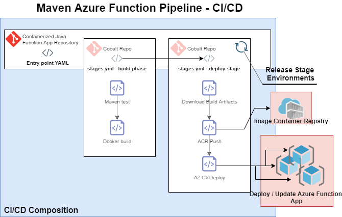

# Maven Azure Function Pipeline - CICD Bootstrap Templates

These YAML templates are designed to handle the build and deploy steps for a serverless Maven based application in Azure. This can be achieved by consuming the template in the application repository as exemplified by `devops/providers/azure-devops/templates/function_app_maven/examples/maven_function_app_usage_example.yml`

## Prerequisites

- Experience with [Azure Pipelines](https://docs.microsoft.com/en-us/azure/devops/pipelines/get-started/key-pipelines-concepts?view=azure-devops) and [YAML templates](https://docs.microsoft.com/en-us/azure/devops/pipelines/yaml-schema?view=azure-devops&tabs=schema%2Cparameter-schema)
- Familiar with the term **CI/CD** (“Continuous Integration / Continuous Deployment”)
- Understand that our use of the term **Containerized Java Function App** is a scenario where a Maven built Java application is running as a container within an Azure Function.

## What is the Maven Azure Function Pipeline?

In order to simplify **CI/CD** configurations for a **Containerized Java Function App**, a **CI/CD** workflow is being orchestrated by a single `yaml` file. This workflow is the **Maven Azure Function Pipeline**. To kick off this workflow, the Containerized Java Function App is responsible for passing it's pipeline variable groups and declared environments to the pipeline. The pipeline then takes advantage of maven `yaml` and docker `yaml` tasks to test the application, build an application container image and push the image to the targeted Azure Function.

- ### Maven Azure Function Pipeline

    The diagram below shows the CI/CD workflow topology needed by our enterprise customers to deploy a Containerized Java Function App to running infrastructure in Azure using the Maven Azure Function Pipeline.

    

	- Readme
		○ Pipeline Diagram
			§ Remove the PR piece from this diagram and other diagrams
			§ Remove "indexer queue" references
			§ reword the "shared maven service pipeline" for the other diagram
			§ use the Image container registry from the other diagram
		○ YAML features
			§ Use this to come up with descriptions of the pipeline
			§ maven test, docker build then save built image to a tar file in the stage directory
			§ per environment, install docker 17.09.0-ce then use azure cli and service principal to log in to the ACR, load the tar file, tag  and then push it as an image.
			§ then push image to functionapp using "az functionapp" to a resource group
			§ TEST during ci stage and deploy during environment_cd stage can be disabled
		○ Variable group naming conventions
			§ Combine the introduction description from the maven pipeline variables groups w/ the function app variable group
			§ Variable groups are named in a way that allows the pipeline to infer rather or not the group belongs to a specific environment within the cd stage. Variable group naming conventions should be respected. They are hardcoded in the following yaml files and are required. More details about the values of these variable groups are described here.
		○ Environment boundaries
If ever wanting to add a new environment to the cd_stage, do this.