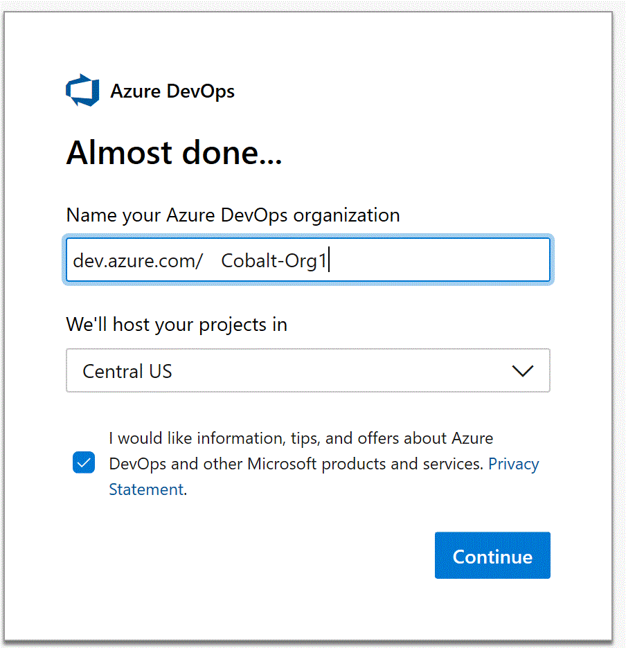
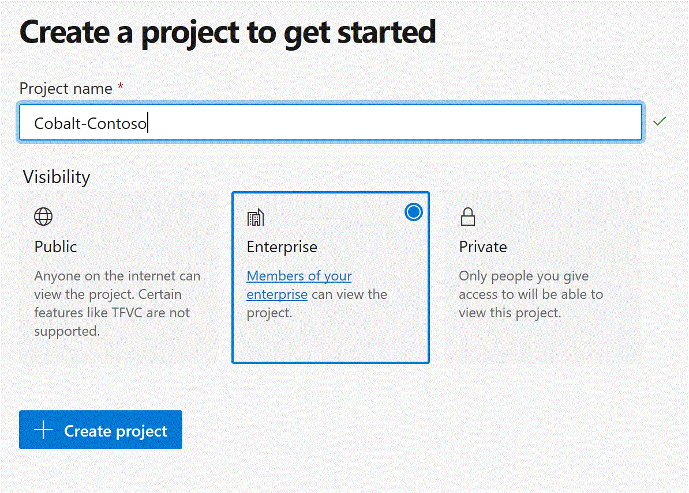
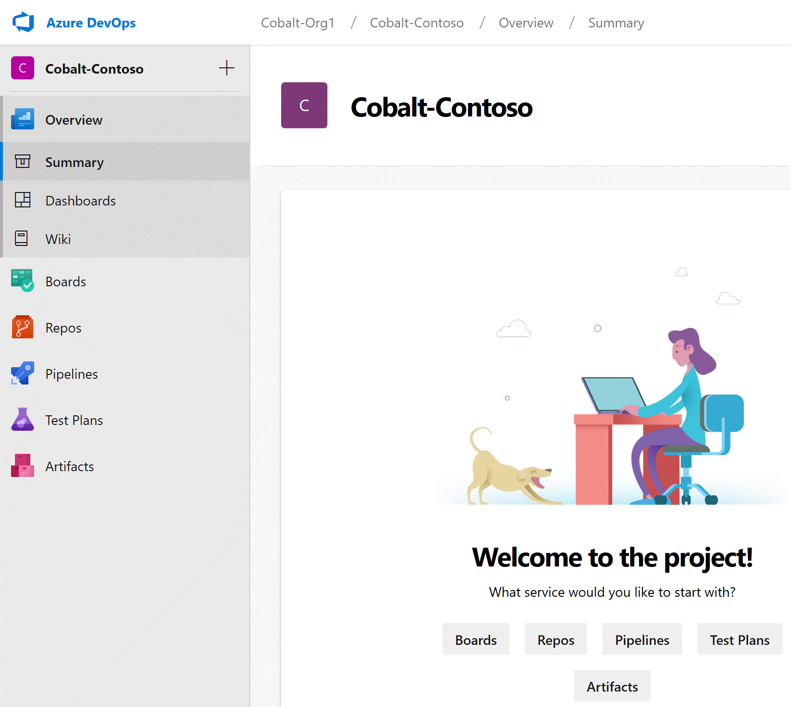
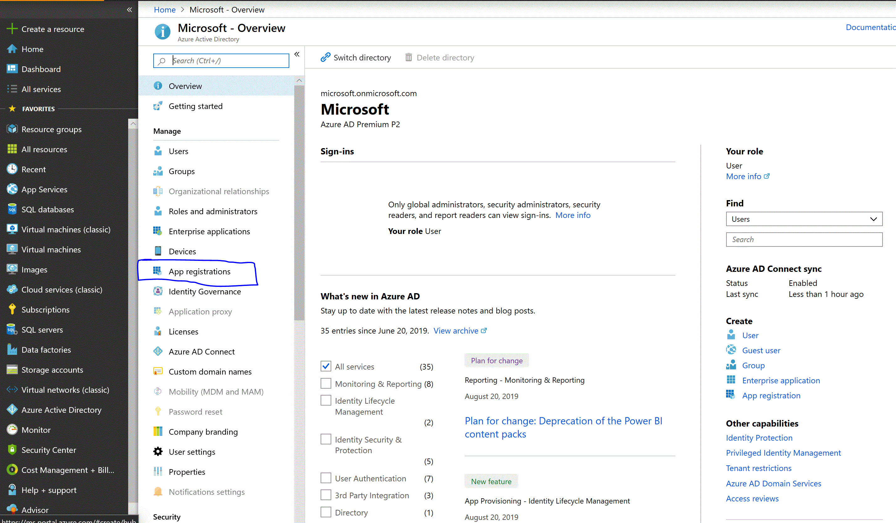
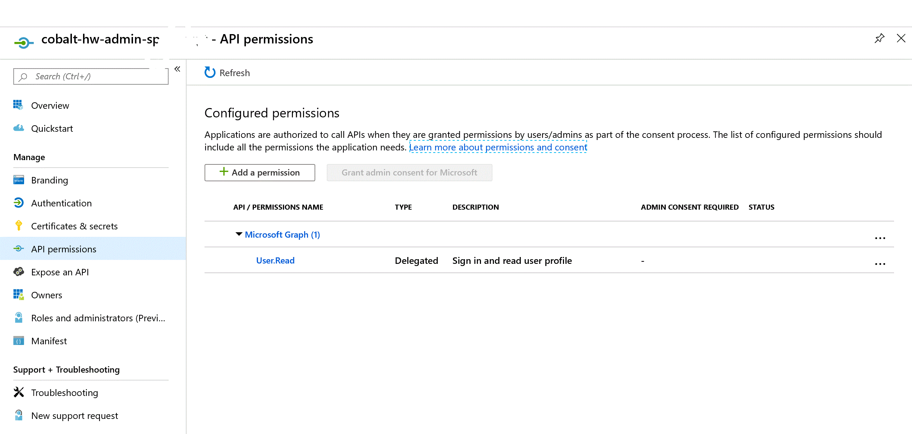
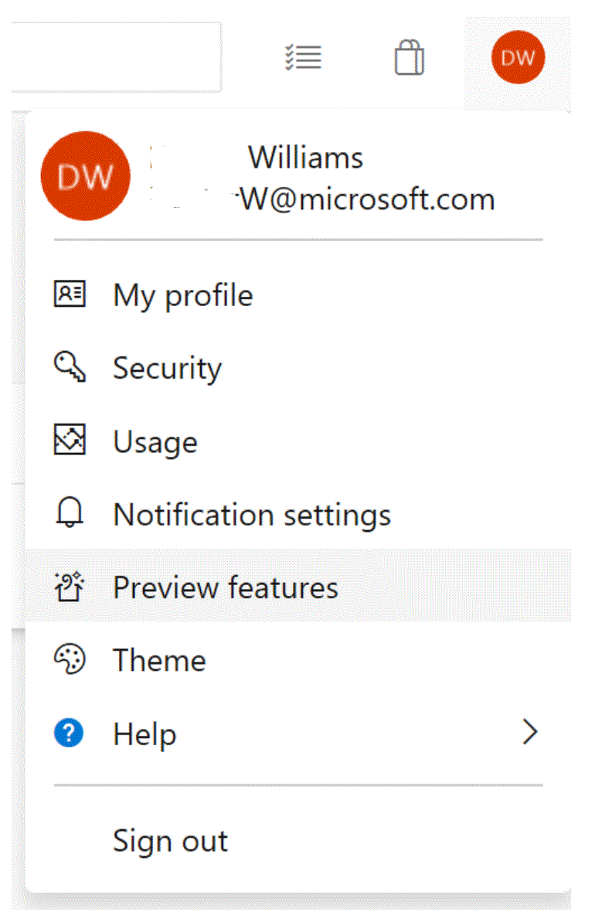

# Getting Started - Advocated Pattern Owner

*Prefer using cli? Follow the [cli-based walkthrough](./GETTING_STARTED_APP_PAT_OWNER_CLI.md).*

## Overview
cobalt templates

The goal of this document is to leverage Azure DevOps to operationalize Cobalt Infrastructure Templates. Completion of these steps results in a configured source code management flow and unified pipeline within Azure DevOps ready for multi-stage environments in Azure.

This section provides Cobalt users instructions for initializing and integrating Cobalt into their existing Azure DevOps organization using an Azure subscription. These steps assume some basic familiarity with the Azure DevOps portal and Azure Cloud portal. For more information on Cobalt, visit the following link: [READ ME](../README.md)

## Prerequisites

  1. An Azure Subscription
  2. Azure DevOps Organization
  3. Permissions to your Organization's Azure DevOps account
  4. An Azure Active Directory Application with a *Global administrator role* permission in your Organization's Tenant. This role is granted the right to create service principals.

> NOTE: If this is not allowed by your organization tenant, completion of step two and the Service Connection creation in step three will need to be completed by someone within your organization with this permission.

### STEPS

1. **Initialize Azure DevOps Repo with Cobalt**

    The following steps help setup an Azure DevOps repo with Cobalt Infrastructure Templates that you can host and deploy. The end result is a cloned Cobalt repo that also comes with a ready to be integrated pipeline configuration needed for automating your infrastructure deployments in Azure DevOps.

    * Create a new project
        1. Sign-in to Azure DevOps (https://azure.microsoft.com/en-us/services/devops/)
        1. Create new project under Organization. First create new Organization if it doesn't exist already. (ex. Cobalt-Contoso)

            
            

    * Create new repository by fetching source code from the master branch of Cobalt's open-source github project. This will allow you to host and grow your own repo for Cobalt Infrastructure Templates.
        1. Select Repos tab within side-navigation menu
        1. Select 'Import a repository' from the Repos tab sub-menu and click [Import]
        1. Enter the Cobalt Clone URL (https://github.com/microsoft/cobalt.git) and select Import

            

    * Personalize the project by renaming your cloned Cobalt repo.
        1. Click your Repo Name (ex. Cobalt-`<Your-Company-Name>`) at the top of the page.

            

        1. Select Manage Repositories
        1. Under Git repositories, find "Cobalt-`<Your-Company-Name>`" and select the ellipses
        1. Select Rename repository

            

        1. Give it a new name and click [Rename]

            | Naming Recommendation  | Template Repo Strategy |
            |-------------|-----------|
            | Cobalt-Hello-World-`<Your-Company-Name>` | If the aim is to introduce oneself or the organization to Cobalt, we recommended a name that assumes this repo will only be hosting the Azure Hello World Cobalt Infrastructure Template. |
            | Cobalt-AZ-ISO-`<Your-Company-Name>` | If already familiar with Cobalt and the aim is to have a single repository represent a single Cobalt Infrastructure Template, and thereafter, to have one repo per template, we recommend a name that reflects the Cobalt Infrastructure Template being deployed. In this naming example, the name assumes this repo will be dedicated to deploying the Cobalt *az-isolated-service-single-region* Infrastructure Template |
            | Cobalt-`<Your-Company-Name>` | If already familiar with Cobalt ad the aim is to use a single repository as ground truth for all potential patterns across your organization, effectively having to manage a combination of Cobalt patterns from a single repo, it's recommended to stick with a name that matches the project name. |

    * Initialize a new Azure DevOps pipeline by integrating an existing YAML file. This file already lives within the newly created repo and is needed as Azure DevOps uses it to orchestrate your Cobalt Infrastructure Template deployments across various deployment stages. By integrating this file, a unified deployment pipeline is executed for you.
        1. Select Pipelines tab from within side-navigation menu
           
           

        1. Select New Pipeline and then choose 'Azure Repos Git [YAML]'

            

        1. Find and select the newly created repository from dropdown menu
        1. Import YAML by selecting 'Existing Azure Pipelines YAML file'
            * Enter the path to the devops yaml file that lives within your newly created repo. (i.e. devops/providers/azure-devops/templates/azure-pipelines.yml)

            

            > NOTE: Automatic drop-down does not always populate with yaml file options. It may be necessary to simply copy and paste the above path.
        1. Review the devops pipeline YAML file and only keep templates relevant to your enterprise patterns. This file effectively tells Azure DevOps which Cobalt Infrastructure Templates to build and deploy across various deployment stages.
            * Remove jobName configurations not relevant to your enterprise patterns. If new to Cobalt, we recommend keeping the path to the az_hello_world template as a starter template. This step can also be completed later as a code commit to your repo. Below is an example of a jobName that you may want to remove by simple deleting it.
                ```yaml
                configurationMatrix:
                - jobName: az_service_single_region
                terraformTemplatePath: 'infra/templates/az-service-single-region'
                terraformWorkspacePrefix: 'sr'
                environmentsToTeardownAfterRelease:
                - 'devint'
                ```
        1. Save and run

            

            > NOTE: Azure Devops forces a run so expect this to fail. Future steps will resolve this problem.

2. **Provision Azure resources needed for Azure Devops pipeline**

    This step sets up all the values and resources that will serve as inputs to your test automation pipeline in Azure DevOps. Without this setup step, you cannot deploy Cobalt Infrastructure Templates to Azure DevOps.

    * Create a registered Azure AD (AAD) app for Cobalt deployments
        1. Sign-in to your organization's Azure account. (https://portal.azure.com)
        2. Filter for Azure Active Directory and navigate to it's menu
        3. Select App registrations from the menu blade
           
           

        4. Click [Add/+] New registration then enter a name for the application (ex. cobalt-hw-admin-sp-`<username>` or cobalt-az-iso-admin-sp-`<username>`)
        5. Choose single tenant as a supported account type
        6. Click Register

    * Setup permissions for the new AAD app to also use legacy API permissions
        1. From the App registrations service blade, select the API permissions
           
           

        3. Configure Azure Activity Directory Application permissions to ReadWrite.OwnedBy. First select Microsoft Graph and then select Application Permissions

            

        4. Click [Add permissions] to save this configuration
        5. Click [Grant admin consent for *Your Directory*] to grant consent on behalf of users in this directory for this permission 

    * Configure the new AAD app as a Cobalt admin service-principal/service-endpoint
        1. From the App registrations service blade, click the [Certificates & secrets] tab
        2. Click [+New client secret] from within the Client secrets menu then enter a description (ex. rbac)

            

        3. Click Add
            > IMPORTANT: Generate a secret that does not have a trailing slash. Secrets that lead with a slash (ex."/","\") may cause parsing errors.

            > NOTE: Take note of the generated client secret (only displayed once). This will be used for your Azure DevOps Service Connection in step 3.
        4. From the App registrations service blade, select Overview.
            > NOTE: Take note of the Application (client) ID. This will also be used for your Azure DevOps Service Connection in step 3.

    * Grant newly created Service Principal an Owner role to your preferred enterprise subscription.

        This elevates the Service Principal with more permissions so that Terraform can rely on this Service Principal as an Azure user for Cobalt Infrastructure Template deployments.

        1. Filter for subscriptions and navigate to the subscriptions list
        2. Either choose a subscription or create a new one (ex. Cobalt-Contoso-Deployments)
        3. Select your chosen subscription then select the Access control (IAM) tab from the menu blade.
        4. Click [+/Add] and select Add role assignment
        5. From the sub-menu, select 'Owner' as a role from the drop down and search for the newly created Service Principal (i.e. cobalt-hw-admin-sp-`<username>` or cobalt-az-iso-admin-sp-`<username>`)

            

        6. Click Save

    * Create Resource Group and Storage Account for backend state
        1. Filter for Storage accounts and navigate to the storage account list
        2. Click [+/Add] and enter values for the following fields:
            * Subscription: Your preferred enterprise subscription for Cobalt template deployments
            * Resource group: Create new (ex. cobalt-devint-hw-admin-rg or cobalt-devint-az-iso-admin-rg )
            * Storage account name: (ex. cobalttfstates)
        3. Click [Review+Create] then [Create]
        4. Once deployment for storage account is completed, go to the resource and visit the Blobs sub-menu
        5. Click [+Container] then create a container name (ex. az-hw-remote-state-container or az-iso-remote-state-container) with private access

3. **Configure Azure DevOps pipeline by referencing Azure resources created in your Azure Cloud Subscription**

    The goal of this step is to have the Azure Devops pipeline referencing the appropriate Azure resources (i.e. Azure Blob Storage Account, etc.) living within your Azure Cloud Subscription. This will ensure that infrastructure deployments are impacting the desired Azure Cloud Subscription and that the deployment process is permissioned to perform various operations needed for proper build and integration across various deployment stages.

    * Add the Azure Subscription being used for Cobalt as a *Service Connection*
        1. Return to your Azure DevOps subscription
        2. Find and select the Project Settings tab at the bottom of the screen
        3. Under the Pipelines menu select Service Connections
        4. From the Service Connections menu, select [+New Service Connection]
        5. Choose Azure Resource Manager from the dropdown then a name for your service (ex. Cobalt Deployment Administrator-`<YourTenantName>`). The name should make sense to users and will be directly referenced in pipeline variable groups later.
        6. Use the full version of the service connection dialog in order to enter your service principal credentials (AAD Key, AAD App ID, Tenant, etc.)

            

        7. Verify and Save the connection
        > NOTE: Take note of the custom name given to this service connection. This will be referenced in later steps needed to configure env variable groups.

    * Enable multi-stage pipelines
        1. Find your signed-in avatar/image and select preview features from the drop down menu

            

        2. Toggle Multi-stage pipelines

    * Configure *Infrastructure Pipeline Variables* as the first of two variable groups
        1. Select Pipelines tab from within side-navigation menu then select Library tab
        2. Click [+Variable group] and name it "Infrastructure Pipeline Variables"
        3. Add the following variables:

            | Name   | Value | Var Description |
            |-------------|-----------|-----------|
            | `AGENT_POOL` | Hosted Ubuntu 1604 | The type of build agent used for your deployment. |
            | `ARM_PROVIDER_STRICT` | true | Terraform ARM provider modification |
            | `BUILD_ARTIFACT_NAME` | drop | Name to identity the folder containing artifacts output by a build. |
            | `GO_VERSION`| 1.12.5 | The version of Go terraform deployments are bound to. |
            | `PIPELINE_ROOT_DIR` | devops/providers/azure-devops/templates/ | A path for finding Cobalt Infrastructure Templates. |
            | `REMOTE_STATE_CONTAINER` | `<BACKEND_STATE_CONTAINER_NAME>`| The remote blob storage container name for managing the state of a Cobalt Infrastructure Template's deployed infrastructure. Also is used as a naming convention for partitioning state into multiple workspaces. This name was created in an earlier step from within the azure portal. |
            | `SCRIPTS_DIR` | infrastructure/scripts | Path to scripts used at runtime for composing build and release jobs at various pipeline stages. |
            | `TEST_HARNESS_DIR` | test-harness/ | A path to the cobalt test harness for running integration and unit tests written in Docker and Golang. |
            | `TF_ROOT_DIR`| infra | The primary path for all Cobalt Infrastructure Templates and the modules they are composed of. |
            | `TF_VERSION`| 0.12.4 | The version of terraform deployments are bound to. |
            | `TF_WARN_OUTPUT_ERRORS`| 1 | The severity level of errors to report. |

    > Important: Every targeted environment specified within the build pipeline expects a
    > variable group specified with the naming convention `<ENVIRONMENT_NAME> Environment Variables`

    * Configure *DevInt Environment Variables* as the final variable group
        1. Environment-specific variables have no default values and must be assigned
        2. Return to the Library tab
        3. Click [+Variable group] and name it *DevInt Environment Variables*
        4. Add the following variables:

            | Name  | Value | Var Description |
            |-------------|-----------|-----------|
            | `ARM_SUBSCRIPTION_ID` | `<ARM_SUBSCRIPTION_ID>` | The Azure subscription ID for which all resources will be deployed. Refer to the Azure subscription chosen in Azure portal for Cobalt deployments. |
            | `REMOTE_STATE_ACCOUNT` | `<AZURE_STORAGE_ACCOUNT_NAME>` | The storage container account name created in a previous step that is used to manage the state of this deployment pipeline. The storage Account is shared among all non-prod deployment stages. |
            | `SERVICE_CONNECTION_NAME` | ex. Cobalt Deployment Administrator-`<TenantName>` | The custom name of the service connection configured in a previous Azure DevOps step that establishes a connection between the Service Principal and the Azure subscription that it's permissioned for. |

    * Link Variable Groups for DevInt and Infrastructure to the Build Pipeline
        1. Select Pipelines tab from within side-navigation menu
        2. Select existing pipeline and then click [Edit]
        3. Next to the [Variables] button at the top of the page, click the ellipses and select Triggers

            

        4. Navigate to the [Variables] tab and begin linking each variable group
        5. Link each variable group, one by one

            

        6. Save the build pipeline

4. **Clone newly created Azure DevOps Repo from your organization**

    With this step, the goal is to pull down the repo into a local environment so that one can begin making code changes.

    * Visit your newly created repo and clone down the repo.

        

        ```bash
        $ git clone <insert-git-repo-url>
        ```

5. **Keep the templates relevant to your enterprise patterns**

    The goal of this step is to continue efforts removing Cobalt Infrastructure Template directories that users have no interest in deploying.

    * Open the project from your favorite IDE and navigate to infrastructure templates `./infra/templates` directory.
    * Manually delete template directories not needed for your enterprise. (Do not delete 'backend-state-setup' template! We also recommended keeping the 'az-hello-world' template as a starter template.)

    

    * Commit the newly pruned project to your newly forked repo.
        ```bash
        $ git commit -m "Removed unrelated templates." && git push
        ```

    > NOTE: The CI/CD pipeline needs to detect a code change to run the template-specific build and release jobs (in their respective stages). To force the template build and release to run, you may add a `FORCE_RUN` environment variable with a value of `true` to your *devint Environment Variables* variable group. You may also add a comment or extra line to a TF or Go file within the template in order for the pipeline script to detect a change without adding any additional override flags.

## Additional Recommendations

Recommended next step is to target containerized applications via their image names from within a Cobalt Infrastructure Template.
