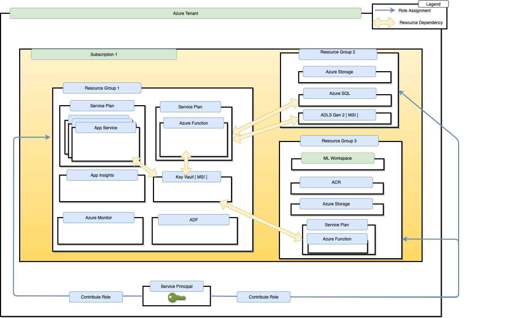
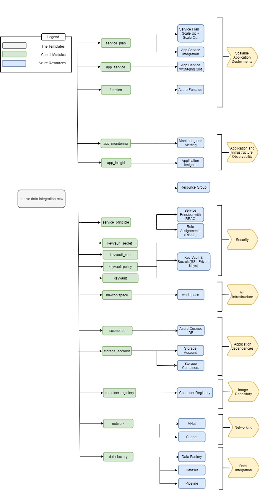

# Technical Design 

This document contains the technical design specs for the Terraform template design and deployment for data integration service with machine learning workspace.

## In Scope

- Identify deployment topology 
- Identify key Terraform templates needed for deployment
- Identify key Terraform modules needed for deployment
- Identify gaps in Terraform provider templates

## Out of Scope

- Template (Terraform, ARM) implementation
- Service Containerization

## Deployment Topology

This graphic shows the targeted deployment topology of this template. The deployment is deployed to a single tenant and subscription. The resources are partitioned to three resource groups to align with the different personas:

- Resource Group 1: contains Application services related resources along with the common resources (i.e. KeyVault, app insights)
- Resource Group 2: Contains storage resources. The best practice is to separate storage resources (i.e. blob storage, SQL, CosmosDB) for protection from any accidental delete
- Resource Group 3: Contains machine learning related resources



## Terraform Template Design

This section shows the infrastructure design. It contains the Azure resources we need according to the architecture diagram. There are some modules that were implemented before and we can re-use them in this project that are shown in the diagram. Moreover, we identified the resources that we need to create modules for. 

## The Template Design Diagram

The Diagram below outlines the topology of the terraform templates that will deploy the topology called out above.



## Example Usage

1. Set the path of your template directory
2. Call the terraform init, plan, apply commands to initialize the terraform deployment then write and apply the plan,

## Template Inputs

### General Inputs

| name | type | default | description |
|---|---|---|---|
| `resource_group_location` | string |  | The Azure region where all resources in this template should be created |
| `prefix` | string |  | It serves as an identifier used to construct the names of all resources in this template
| `randomization_level` | number |  | Number of additional random characters to include in resource names to insulate against unexpected resource name collisions |


### service_plan

| name | type | default | description |
|---|---|---|---|
| `monitoring_dimension_values` | `["*"]` |  | Dimensions used to determine service plan scaling |
| `service_plan_size` | string | S1 | The size of the service plan instance. Valid values are I1, I2, I3 |
| `service_plan_tier` | string | Standard | The tier under which the service plan is created. Details can be found at https://docs.microsoft.com/en-us/azure/app-service/overview-hosting-plans |
| `scaling_rules` | list | list | The scaling rules for the app service plan. Schema defined here: https://www.terraform.io/docs/providers/azurerm/r/monitor_autoscale_setting.html#rule. Note, the appropriate resource ID will be auto-inflated by the template |

**Note:** Service plan name is auto generated within the template


### app-service

| name | type | default | description |
|---|---|---|---|
| `app_service_settings` | list(object) | {} | Map of app settings that will be applied across all provisioned app services |
| `vnet_subnet_id` | string |  | The vnet integration subnet gateway identifier |
| `auth_suffix` | string |  | A name to be appended to all azure ad applications |

### function

| name | type | default | description |
|---|---|---|---|
| `app_services` | list(object) |  | Descriptions of the app services to be deployed. Service level config settings can be provided with the required attribute app_settings |

### app_monitoring

- rule is a type defined [here](https://www.terraform.io/docs/providers/azurerm/r/monitor_autoscale_setting.html#rule)
- MetricsConfig is a complex map type  that adheres to this schema:

```hcl
list(map(object({
	action_group_name           = string
	action_group_email_receiver = string
	metrics = list(map(object({
		metric_alert_name                 = string
		metric_alert_frequency            = string
		metric_alert_period               = string
		metric_alert_criteria_namespace   = string
		metric_alert_criteria_name        = string
		metric_alert_criteria_aggregation = string
		metric_alert_criteria_operator    = string
		metric_alert_criteria_threshold   = string
	})))
})))
```

### app_insight

| name | type | default | description |
|---|---|---|---|
| `appinsights_application_type` | string |  | Type of the App Insights Application.  Valid values are ios for iOS, java for Java web, MobileCenter for App Center, Node.JS for Node.js, other for General, phone for Windows Phone, store for Windows Store and web for ASP.NET |

### vnet

| name | type | default | description |
|---|---|---|---|
| `address_space` | string | list(string) | The address space that is used the virtual network. You can supply more than one address space. Changing this forces a new resource to be created | 
| `address_prefix` | list(list(string))| | The address prefix to use for the subnet |

### keyvault

| name | type | default | description |
|---|---|---|---|
| `keyvault_name` | string |  | Name of the keyvault to create |

### Keyvault_policy

| name | type | default | description |
|---|---|---|---|
| `vault_id` | string |  |Specifies the name of the Key Vault resource |
| `tenant_id` | string |  |The Azure Active Directory tenant ID that should be used for authenticating requests to the key vault. Changing this forces a new resource to be created |
| `object_ids` | list(string) |  |The object IDs of a user, service principal or security group in the Azure Active Directory tenant for the vault. The object ID must be unique for the list of access policies. Changing this forces a new resource to be created |

### ml_workspace

| name | type | default | description |
|---|---|---|---|
| `ml_workspace_sku_name` | string | "Enterprise" | Specifies the name of the Key Vault resource |

### storage_account

| name | type | default | description |
|---|---|---|---|
| `container_names` | list(string) |  | The list of storage container names to create. Names must be unique per storage account |

### container_registry

| name | type | default | description |
|---|---|---|---|
| `container_registry_sku` | list(object) | "Standard" | The container registry SKU. ie. 'Standard' 'Premium'. |

### data_factory

| name | type | default | description |
|---|---|---|---|
| `adf_trigger_name` | string |  | Specifies the name of the Data Factory Schedule Trigger. Changing this forces a new resource to be created. Must be globally unique |
| `pipeline_name ` | string |  | The Data Factory Pipeline name that the trigger will act on |
| `interval` | number | 1 | The interval for how often the trigger occurs. This defaults to 1 |
| `frequency ` | string | "Minute" |  The trigger freqency. Valid values include Minute, Hour, Day, Week, Month. Defaults to Minute.

### private_endpoint

| name | type | default | description |
|---|---|---|---|
| `private_connection_name` | string | | Specifies the Name of the Private Service Connection. Changing this forces a new resource to be created | 
| `is_manual_connection` | boolean | false | Does the Private Endpoint require Manual Approval from the remote resource owner? Changing this forces a new resource to be created |
| `private_connection_resource_id ` | string | | The ID of the Private Link Enabled Remote Resource which this Private Endpoint should be connected to. Changing this forces a new resource to be created |

## Template Output

| name | type | description |
|---|---|---|
| `app_service_config` | map(string) | Map of app service name with their respective slot apps |
| `app_service_fqdns` | map(string) | Map of app service name to VNET accessible domain name |
| `app_service_names` | list(string) | List of provisioned app service names |
| `app_service_ids` | list(string) | The IDs of the app services provisioned |
| `azuread_app_ids` | list(string) | The AAD application object ids used for app service easy auth |
| `app_service_msi_object_ids` | list(string) | The app service System Assigned MSI object ids |
| `service_plan_name` | string | Service Plan Name |
| `service_plan_id` | string | Service Plan Resource ID |
| `resource_group` | string | Resource group name for the application specific resource group |
| `service_principal_application_id` | string | Service principal application ID |
| `key_vault_endpoint` | string | Key Vault endpoint |
| `blob_storage_endpoint` | string | Blob Storage endpoint |
| `sys_storage_account` | string | The name of the ml storage account |
| `sys_storage_account_id` | string | Resource Identifier of the ml storage account |
| `sys_storage_account_containers` | string | Map of the ml storage account containers |
| `app_storage_account_name` | string | Name of Storage Account |
| `app_storage_account_id` | string | Resource Identifier of the storage account |
| `app_storage_account_containers` | string | Map of storage account containers |
| `function_app_properties` | map(string) | Map of function app id and fqdn  |
| `function_app_fqdns` | list(string) | The URLs of the app services created |
| `rule_resource_id` | string | The id of a metric alert rule |
| `container_registry_id` | string | The resource identifier of the container registry |
| `container_registry_name` | string | The name of the container registry.  |
| `contributor_service_principal_id` | string | ID of the service principal with contributor access to provisioned resources |
| `ml_identity_principal_id` | list(string) | The id of the Azure Machine Learning service managed identity object id |
| `mlw_dev_resource_group` | string | Resource group name for the ML specific resources |
| `sql_fuuly_qualified_domain_name` | string |  The fully qualified domain name of the Azure SQL Server (e.g. myServerName.database.windows.net) |
| `adf_id` | string | The ID of the Data Factory Schedule Trigger | 
| `private_endpoint_id` | string | The ID of the Private Endpoint |
| `virtual_network_id` | string | The ID of the virtual network |

## Customers/Persona

- **Admin**: This persona represents an administrator of Azure. This persona does not implement the line of business applications but will help other teams deliver them.
- **App Developer Team**: This persona is responsible for creating and maintaining the line of business applications

### Credentials Management

Managed Identities (MI, or MSI) will be used to manage access to credentials when possible. This table identifies MSI support for each resource leveraged by the template (full compatability breakdown [here](https://docs.microsoft.com/en-us/azure/active-directory/managed-identities-azure-resources/services-support-managed-identities)):

| Azure Service | Supports MSI | Mitigation Strategy |
|---|---|---|
| App Service | Yes | N/A |
| Key Vault | Yes | N/A |
| Azure Functions | Yes | N/A |
| Blob Storage | Yes | N/A |
| Azure SQL | Yes | N/A |
| Azure Data Factory | Yes (System Assigned only) | N/A |
| Azure Container Registery | Yes | N/A|


### Risks

- Ingress / Egress for app services, functions and storage endpoints are not restricted to virtual network(s) by default. In summary, by default these services are exposed to the public internet.
  - Mitigation strategy: App Service VNET access restriction can be enabled by setting the `vnet_subnet_id` setting. We still need to support VNET restrictions for the functions and ML workspace modules.

## Security

Here is an overview of the security for the deployment strategy and templates discussed above:

- **Role Assignments**: 

The service principal running the deployment will have to be an owner in the target subscription and granted admin consent to the `Application.ReadWrite.OwnedBy` role in Microsoft Graph. This template creates a new service principal that will be available for application developer team(s) to administer the provisioned Azure resources. The following role assignments will be made to that service principal:
  - Contributor access to App Service & App Insights in the first Resource Group
  - Contributor access to the second and third Resource Groups. *If needed, we can lock this down further by granting role access to individual resources in this RG.*
- **Service to Service communication**: For services owned by the application development team persona we will leverage Managed Service Identity (MSI) for authenticating to cloud services wherever possible. Where this is not possible, MSI will be used to pull credentials from Key Vault. This connection is done via MSI and therefore it keeps all secrets out of the codebase. This limits the attack vector of the infrastructure. [List of services that support MSI](https://docs.microsoft.com/en-us/azure/active-directory/managed-identities-azure-resources/services-support-managed-identities)

### Role Assignments

//Add the role assignments for the project in this section
